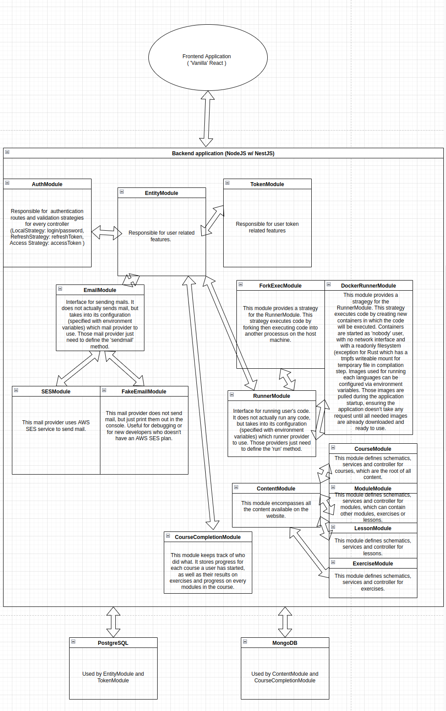
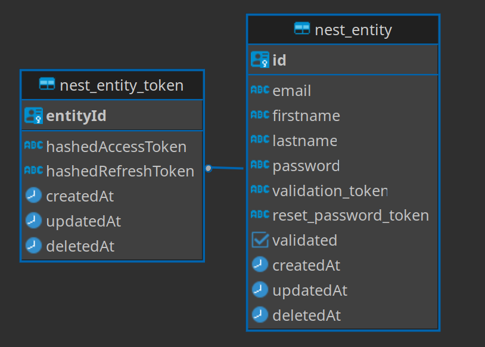
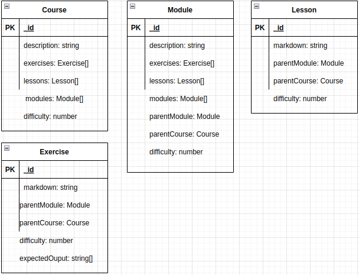
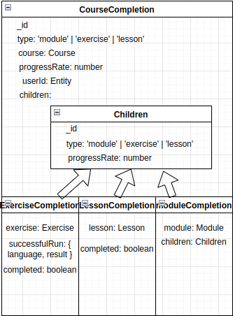

## Installation

```bash
$ yarn
```

## Running the app

```bash
# development
$ npm run start

# watch mode
$ npm run start:dev

# production mode
$ npm run start:prod
```

## Environment variables :

`REFRESH_PRIVATE_KEY`: Optional. Used for refresh token encryption
`REFRESH_PUBLIC_KEY`: Optional. Must correspond to the key pair of the refresh token private key.
`ACCESS_PRIVATE_KEY`: Optional. Used for access token encryption
`ACCESS_PUBLIC_KEY`: Optional. Must correspond to the key pair of the access token private key.

`EMAIL_PROVIDER`: Must be defined. Either `fake` or `SES`. If set to fake, the application will not send any email, but print what it would have sent on stdout. If set to `SES` ( Amazon Simple Email Service ), you must provide `EMAIL_SES_SECRET`, `EMAIL_SES_REGION` and `EMAIL_SES_AKI`.

`RUNNER_PROVIDER`: Must be defined. Either `forkexec` or `docker`. Specifies the strategy to use for running code payloads.
`RUNNER_TIMEOUT`: Optional. Defines the timeout before killing the runner. Default to `15000` ms.
`RUNNER_DOCKER_JAVA_IMAGE`: Optional. When using the `docker` runner strategy, specifies what image to use. Defaults to `openjdk:17-jdk`
`RUNNER_DOCKER_NODE_IMAGE`: Optional. When using the `docker` runner strategy, specifies what image to use. Defaults to `openjdk:17-jdk`
`RUNNER_DOCKER_RUST_IMAGE`: Optional. When using the `docker` runner strategy, specifies what image to use. Defaults to `openjdk:17-jdk`
`RUNNER_DOCKER_PYTHON_IMAGE`: Optional. When using the `docker` runner strategy, specifies what image to use. Defaults to `openjdk:17-jdk`

`MONGO_HOST`: Optional. Mongo url to use to connect to the mongo database. Defaults to `mongodb://localhost/polycode`
`MONGO_USER`: Optional. Mongo user to use to connect to the mongo database. Defaults to `user`
`MONGO_PASSWORD`: Optional. Mongo password to use to connect to the mongo database. Defaults to `password`

If anything is not set properly, an error message should be displayed when running the app.

# Architectural model:
</img>

# Databases models:

## Postgresql models:

This is the schema used in the postgresql database.

</img>

`nest_entity_token` represents a relation between an entity ( a user ) and its tokens. The information about the user is actually persisted inside `nest_entity` table, such as their validation token (when creating an account) or their reset password token (forgot password feature).


## Mongo models:

### Content model

</img>

The content model is used to store the content of the application. It is organized in a tree structure, with a Course as root. Each course has a list of lessons, exercises or module. Each module can also have a list of lessons, exercises or modules.

Exercises contains the expected output. When a user run their code, each line of the output is compared to the expected output. If the two are different, the test fails. If it matches, the exercise is passed.

### Coursecompletion model

The coursecompletion model is used to store the completion status of a user for a course. It is made of only one collection, where each document at the route is of the CourseCompletion model. Inside this model, there are subdocuments, stored in the `children` array, which are either of the `LessonCompletion`,  `ExerciseCompletion` or `ModuleCompletion` models.

The field progressRate of each of these subdocuments is used to compute the progressRate of the course. Before every save, the progressRate is computed and stored in the `progressRate` field for each subdocument. The progressRate is computed by summing the progressRate of all the subdocuments, and dividing by the number of subdocuments.

This collection is indexed by the `courseId` and `entityId` field, which is used to quickly find all the coursecompletions for a given entity. This forms a unique index, making sure that there is only one coursecompletion for a given user.

</img>

# CI/CD and production.

## Deployment

I host a kubernetes cluster on my server (using K3D, K3S in docker). I have a nginx ingress controller that is used to redirect the traffic to the kubernetes cluster. It redirects simonlucido.com to the frontend, and api.simonlucido.com to the backend.

The frontend is served inside the kubernetes cluster with a simple nginx.

## CI/CD 
Since the backend and frontend pipelines are virtually the same, I will only be explaining the backend pipeline.

Using github actions, I listen to any push event to the `master` branch. When a push event is received, I build the application, by cloning it from the github repository, and running the build script.
Once dependency resolved, I run another actions that build the docker image and push it to the Github container registry.

I then dispatch an event to the `deployments` repository, which will trigger the deployment of the new image to the kubernetes cluster, using helm charts. This is where the environment variables are injected from the github repository secrets.

Since the kubernetes control plane is on my polytech server, I need to run the pipeline from inside Polytech's network to avoid the firewall. This is why the repos are private (Github has a limitation where you can only run on self-hosted runner if the repo is private).
# Technological choices

I won't be discussing React here, since it was not really a choice to use it. However, I wanted to point out that I could have used some "metaframeworks" like Next or Redux, but I didn't, since I wanted to build a deeper understanding of React before using any of those frameworks.

For the backend, I went with NestJS. This is a framework I had some experience with in the past, mostly to discover how to use it. I had quite a great experience with it, since it simplifies a lot the creation of modular applications, with a robust, Angular-like DI system. 

It speeds up the creation of applications, with a lot of decorators, and built-in features for a powerful validation of DTOs, or configuration. I spent a lot of time playing with its Dynamic module system.

However, as it often happens with high level framework like this one, you quickly lose the understanding of how things are done behind the scenes. Documentation is great to learn how to use the framework, but it doesn't often explain how it works. Once things start going South, you have to spend a lot of time looking at the code to understand what is going on.

For the databases, I went for a relational database for the entity/token model. The simple fields and relational nature of those entities is what made me choose this a relational database.

I had some troubles figuring out if I would use a relational database or a document database for storing content (courses, modules, lessons, exercises). The relational nature of the entities made me hesitate, but in the end I decided to go with mongodb, for its ability to store complex and variable objects.

# Post-mortem

I, once again, have a lot of regrets on how I managed my time during this project. Unlike the previous projects, I started working on the project right away and I had a lot of time to spare. However, I didn't commit more time to the project than I needed to in the later weeks. I ended up last week having pretty much over half of the project to do even though I had a lot of things to do during this week.

I think that the quality of the code degrades drastically over time, as I became more and more rushed. The frontend is not well designed, clearly not polished, very few errors are fixed, and the code is not well documented. The backend is ready to support a lot more features that the frontend actually uses.

However, I'm happy with how I made the backend application. I think I learned a lot on how to structure an application, through the use of nestjs' dynamic modules, which forced me to think what and how every modules would relate to eachother. 

I think I now have a good grasp on how React works, and I will try to explore what it can do further.